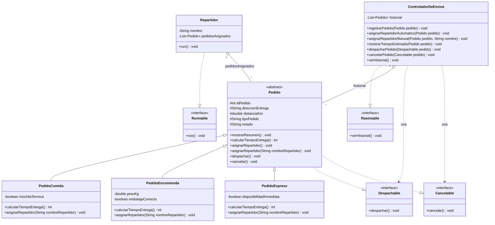
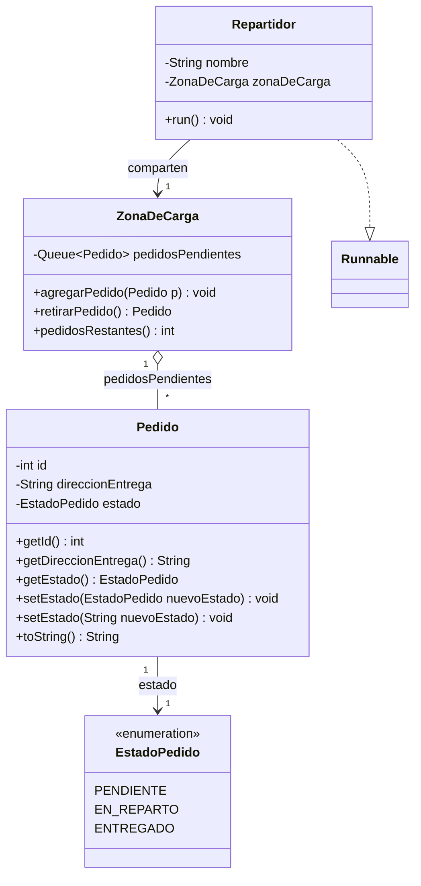

# Sistema de entregas SpeedFast

Proyecto en Java que simula el sistema de asignación, cálculo de tiempos, despacho,
cancelación, historial, entrega concurrente y sincronización de acceso a recursos compartidos
de **SpeedFast**, una empresa de reparto a domicilio con tres tipos de servicio: comida,
encomiendas y compras express. El proyecto se desarrolla en cinco semanas, cada una
incorporando un principio distinto de la Programación Orientada a Objetos y la concurrencia.

- **Semana 1 — Sobrecarga y sobreescritura**: `asignarRepartidor()` se **sobrescribe** en cada
  subclase, y `asignarRepartidor(String nombreRepartidor)` es una versión **sobrecargada** (misma
  funcionalidad, distinta firma) que agrega la validación propia de cada tipo de pedido.
- **Semana 2 — Clase abstracta**: `Pedido` pasa a ser una clase **abstracta** que centraliza los
  atributos y el método `mostrarResumen()`, y declara el método abstracto
  `calcularTiempoEntrega()`, que cada subclase implementa con su propia fórmula.
- **Semana 3 — Interfaces**: se agregan las interfaces `Despachable`, `Cancelable` y
  `Rastreable` para desacoplar el despacho, la cancelación y el historial de la lógica interna
  de cada pedido, orquestadas por una nueva clase `ControladorDeEnvios`.
- **Semana 4 — Concurrencia**: se agrega la clase `Repartidor`, que implementa `Runnable` y
  entrega su lista de pedidos en un hilo independiente; `Main` ejecuta varios repartidores en
  paralelo con `ExecutorService`.
- **Semana 5 — Sincronización**: nuevo paquete `Sincronizacion`, autocontenido, donde varios
  `Repartidor` compiten por retirar pedidos de una `ZonaDeCarga` compartida usando métodos
  `synchronized`, garantizando que cada pedido se entregue una única vez.

## Estructura del proyecto

Cada paquete agrupa una única responsabilidad: los pedidos, los contratos (interfaces) que
pueden cumplir, y el componente que orquesta el sistema.

```
src/
├── Main.java                       # Punto de entrada, simula el flujo completo
├── Gestion_Pedidos/
│   ├── Pedido.java                 # Clase abstracta base (implementa Despachable, Cancelable)
│   ├── PedidoComida.java           # Valida mochila térmica
│   ├── PedidoEncomienda.java       # Valida peso y embalaje
│   └── PedidoExpress.java          # Valida cercanía y disponibilidad inmediata
├── Interfaces_Pedido/
│   ├── Despachable.java            # Interfaz: despachar()
│   ├── Cancelable.java             # Interfaz: cancelar()
│   └── Rastreable.java             # Interfaz: verHistorial()
├── Gestion_Envios/
│   └── ControladorDeEnvios.java    # Orquesta asignación, despacho, cancelación e historial
├── Concurrencia/
│   └── Repartidor.java             # Runnable: entrega su lista de pedidos en un hilo propio
└── Sincronizacion/                 # Ejercicio autocontenido de la semana 5 (no depende de lo anterior)
    ├── EstadoPedido.java           # enum: PENDIENTE, EN_REPARTO, ENTREGADO
    ├── Pedido.java                 # id, direccionEntrega, estado + toString()
    ├── ZonaDeCarga.java            # Recurso compartido: agregarPedido()/retirarPedido() synchronized
    └── Repartidor.java             # Runnable: compite por pedidos en la ZonaDeCarga compartida
```

> Nota: `Sincronizacion` define sus propias clases `Pedido` y `Repartidor`, independientes de
> `Gestion_Pedidos.Pedido` y `Concurrencia.Repartidor`. La actividad de la semana 5 pide una
> clase `Pedido` mínima (`id`, `direccionEntrega`, `estado`) enfocada en sincronización, distinta
> del `Pedido` abstracto y con reglas de negocio de las semanas 1-4; por eso vive en su propio
> paquete en vez de mezclarse con la jerarquía existente.

## Diagrama de clases



## Jerarquía de clases

### `Pedido` (clase abstracta)

Atributos comunes a todo pedido:

| Atributo           | Tipo     | Descripción                                    |
|---------------------|----------|-------------------------------------------------|
| `idPedido`          | `int`    | Identificador del pedido                         |
| `direccionEntrega`  | `String` | Dirección donde se debe entregar                |
| `distanciaKm`       | `double` | Distancia a recorrer, usada para estimar el tiempo |
| `tipoPedido`        | `String` | Etiqueta del tipo de pedido (usada en los logs de asignación) |
| `estado`            | `String` | `Pendiente`, `Despachado` o `Cancelado`          |

Métodos:

```java
public void mostrarResumen()          // implementado: imprime id, dirección y distancia
public abstract int calcularTiempoEntrega(); // abstracto: cada subclase define su fórmula

public void asignarRepartidor()                       // sobrescrito por cada subclase
public void asignarRepartidor(String nombreRepartidor) // sobrecargado y sobrescrito

public void despachar()   // implementa Despachable
public void cancelar()    // implementa Cancelable
```

### `PedidoComida extends Pedido`

Agrega `mochilaTermica` (`boolean`).

- `calcularTiempoEntrega()`: **15 min + 2 min por cada km** (`15 + 2 * distanciaKm`).
- `asignarRepartidor(String)`: valida que el repartidor cuente con mochila térmica.

### `PedidoEncomienda extends Pedido`

Agrega `pesoKg` (`double`) y `embalajeCorrecto` (`boolean`).

- `calcularTiempoEntrega()`: **20 min + 1.5 min por km**, ajustado a entero
  (`Math.round(20 + 1.5 * distanciaKm)`).
- `asignarRepartidor(String)`: valida embalaje correcto y peso máximo de 20 kg.

### `PedidoExpress extends Pedido`

Agrega `disponibilidadInmediata` (`boolean`).

- `calcularTiempoEntrega()`: **10 min base**; si `distanciaKm > 5`, se suman **5 min extra**.
- `asignarRepartidor(String)`: valida cercanía/disponibilidad inmediata del repartidor.

## Semana 5: sincronización con `ZonaDeCarga`

Paquete `Sincronizacion`, un ejercicio independiente centrado en **evitar condiciones de
carrera** cuando varios hilos acceden a un mismo recurso compartido.



- **`EstadoPedido`** (enum): `PENDIENTE`, `EN_REPARTO`, `ENTREGADO`. Reemplaza estados de texto
  libre por constantes verificadas en tiempo de compilación.
- **`Pedido`**: `id`, `direccionEntrega` y `estado` (tipado como `EstadoPedido`), con
  constructor, getters, `toString()` y **dos `setEstado()` sobrecargados** — uno que recibe el
  enum directamente y otro que recibe un `String` (`EstadoPedido.valueOf(...)`), tal como pide
  la actividad.
- **`ZonaDeCarga`**: recurso compartido entre todos los repartidores. Usa una `Queue<Pedido>`
  (`LinkedList`) protegida con los métodos `synchronized void agregarPedido(Pedido)` y
  `synchronized Pedido retirarPedido()`. Al ser `synchronized`, solo un hilo a la vez puede
  ejecutar cualquiera de los dos métodos sobre la misma instancia, así que dos repartidores
  **nunca** pueden retirar el mismo pedido — `retirarPedido()` es la única puerta de entrada a
  la cola, y `poll()` extrae y elimina en un solo paso atómico dentro de la sección crítica.
- **`Repartidor`**: implementa `Runnable` con `nombre` y una referencia a la `ZonaDeCarga`
  compartida (no una lista propia, a diferencia del `Repartidor` de la semana 4). En `run()`,
  repite en bucle: retira un pedido, lo pasa a `EN_REPARTO`, simula la entrega con
  `Thread.sleep()` (duración aleatoria de 1 a 3 segundos), y lo marca `ENTREGADO`. El bucle
  termina cuando `retirarPedido()` devuelve `null` (zona de carga vacía).

`Main` instancia una `ZonaDeCarga`, agrega 6 pedidos, y lanza 3 `Repartidor` mediante un
`ExecutorService` de tamaño fijo; espera con `shutdown()` + `awaitTermination()` a que los tres
vacíen la zona de carga antes de imprimir "Todos los pedidos han sido entregados
correctamente". Como los tres repartidores compiten por la misma cola (en vez de tener listas
fijas asignadas), el reparto de pedidos entre ellos varía en cada ejecución, pero el total
entregado siempre es igual a la cantidad de pedidos agregados — evidencia de que no hay
retiros duplicados ni pedidos perdidos.

## Semana 4: concurrencia con `Repartidor` y `ExecutorService`

Se agrega el paquete `Concurrencia` con la clase `Repartidor`, que simula a un repartidor
entregando su lista de pedidos en un **hilo independiente**:

- Implementa `Runnable`; su atributo `nombre` y su lista `pedidosAsignados` (`List<Pedido>`)
  se reciben por constructor.
- `run()` recorre los pedidos **secuencialmente** (un repartidor entrega uno a la vez), pero
  cada `Repartidor` corre en su propio hilo, por lo que varios repartidores entregan **en
  paralelo** entre sí.
- Por cada pedido: imprime el tiempo estimado (`calcularTiempoEntrega()`), simula la entrega
  con `Thread.sleep()` usando una duración aleatoria (1 a 3 segundos,
  `ThreadLocalRandom.nextInt(1000, 3001)`), y llama a `pedido.despachar()` (interfaz
  `Despachable`, reutilizada de la semana 3). Si el pedido ya fue cancelado, `despachar()` lo
  rechaza y `Repartidor` lo reporta en vez de marcarlo como entregado.

`Main` reutiliza toda la jerarquía y las interfaces previas: crea 6 pedidos (2 de cada tipo),
los registra en un `ControladorDeEnvios` (`Rastreable`), cancela uno de antemano para probar
la validación cruzada con `Cancelable`, y arma 3 repartidores con 2 pedidos cada uno.

La ejecución paralela se hace con `ExecutorService`:

```java
ExecutorService executor = Executors.newFixedThreadPool(3);
executor.submit(repartidor1);
executor.submit(repartidor2);
executor.submit(repartidor3);

executor.shutdown();
executor.awaitTermination(1, TimeUnit.MINUTES); // espera a que los 3 terminen
```

Como las esperas (`Thread.sleep`) son aleatorias, el orden de los mensajes en consola varía en
cada ejecución — evidencia visual de que los tres repartidores avanzan de forma simultánea e
independiente, y no uno después del otro.

## Semana 3: interfaces y `ControladorDeEnvios`

Se agregan tres interfaces en el paquete `Interfaces_Pedido`, cada una con una única
responsabilidad:

- **`Despachable`** → `despachar()`
- **`Cancelable`** → `cancelar()`
- **`Rastreable`** → `verHistorial()`

`Pedido` (en `Gestion_Pedidos`) implementa `Despachable` y `Cancelable`, ya que despachar o
cancelar es una operación propia de cada pedido individual (cambia su `estado` interno). Un
pedido ya `Despachado` no puede cancelarse, y uno `Cancelado` no puede despacharse.

`Rastreable`, en cambio, se implementa en `ControladorDeEnvios` (paquete `Gestion_Envios`),
porque el historial es una responsabilidad del sistema (que administra una lista de pedidos),
no de un pedido individual. Al vivir en su propio paquete, `ControladorDeEnvios` no depende de
los detalles internos de `Gestion_Pedidos`, solo de las interfaces que necesita.
`ControladorDeEnvios` mantiene internamente un `ArrayList<Pedido>` y expone:

- `registrarPedido(Pedido)` — agrega un pedido al historial.
- `asignarRepartidorAutomatico(Pedido)` / `asignarRepartidorManual(Pedido, String)` — delegan en
  las versiones sobrescrita y sobrecargada de `asignarRepartidor()`.
- `mostrarTiempoEstimado(Pedido)` — llama a `mostrarResumen()` y `calcularTiempoEntrega()`.
- `despacharPedido(Despachable)` / `cancelarPedido(Cancelable)` — reciben el **tipo interfaz**,
  no `Pedido`, por lo que el controlador no depende de la jerarquía concreta de pedidos.
- `verHistorial()` — imprime cada pedido registrado junto a su estado actual.

### Contribución a escalabilidad, reutilización y mantenibilidad

- **Escalabilidad**: agregar un nuevo tipo de servicio (por ejemplo, `PedidoProgramado`) solo
  requiere extender `Pedido` e implementar `calcularTiempoEntrega()` y
  `asignarRepartidor(String)`; el resto del sistema (`ControladorDeEnvios`, interfaces) no
  cambia.
- **Reutilización**: `ControladorDeEnvios` opera sobre `Despachable` y `Cancelable`, por lo que
  cualquier clase futura que implemente esas interfaces (no solo `Pedido`) puede reutilizar la
  misma lógica de despacho/cancelación sin modificar el controlador.
- **Mantenibilidad**: separar `verHistorial()` en una interfaz distinta a `Pedido` evita que la
  clase abstracta cargue con responsabilidades ajenas a un pedido individual; un cambio en cómo
  se presenta el historial afecta solo a `ControladorDeEnvios`, no a la jerarquía de pedidos.

## Semana 2: clase abstracta y `calcularTiempoEntrega()`

`Pedido` no puede instanciarse directamente (`abstract class`); solo sus subclases pueden
crearse, y cada una está obligada a implementar `calcularTiempoEntrega()` con su propia lógica.
`mostrarResumen()` sí está implementado en la clase base y es **heredado sin cambios** por las
tres subclases, reutilizando el nombre real de la clase (`getClass().getSimpleName()`) para
imprimir el encabezado:

```
PedidoComida #001

Dirección: Av. Italia 456
Distancia: 4 km
Tiempo estimado de entrega: 23 minutos
```

## Semana 1: sobrecarga y sobreescritura de `asignarRepartidor()`

1. `asignarRepartidor()` (sin argumentos) está **sobrescrito** en cada subclase e imprime el
   encabezado del pedido y el mensaje "Asignando repartidor...".
2. `asignarRepartidor(String nombreRepartidor)` está **sobrecargado** (misma clase, distinta
   firma) y además **sobrescrito** en cada subclase: ejecuta la validación propia del tipo de
   pedido y, si es válida, confirma la asignación con el nombre del repartidor.

```
[Pedido Comida]
Asignando repartidor...
→ Verificando mochila térmica... OK
→ Pedido asignado a Juan Pérez
```
